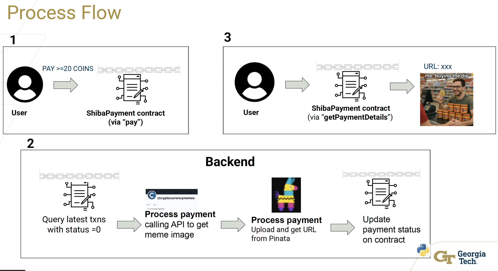

# meme-merchant-contract
solidity contract to get meme picture with offchain backend service

## Step to deploy on local
1. Start ganache with the command `ganache-cli` (*Note: you might need to install ganache with npm, follow steps [here](https://www.npmjs.com/package/ganache-cli))
2. Select 1 private key from the ganache list above, replace variable `private_key` 
3. Run all the cells in `deploy.ipynb`. Take note of the deployed contract address (var `exploit_address`)
4. From `run.py`, update `exploit_address`, and owner's private key (var `private_key`).
5. `python run.py > log.log 2>&1&` to run the backend service in background.
6. From `sample-call.ipynb`, update `exploit_address`, `YOUR_SK`, `YOUR_PK`. 
7. Run all the cells in `sample-call.ipynb`.

## Demo screenshot

## Process Flow

